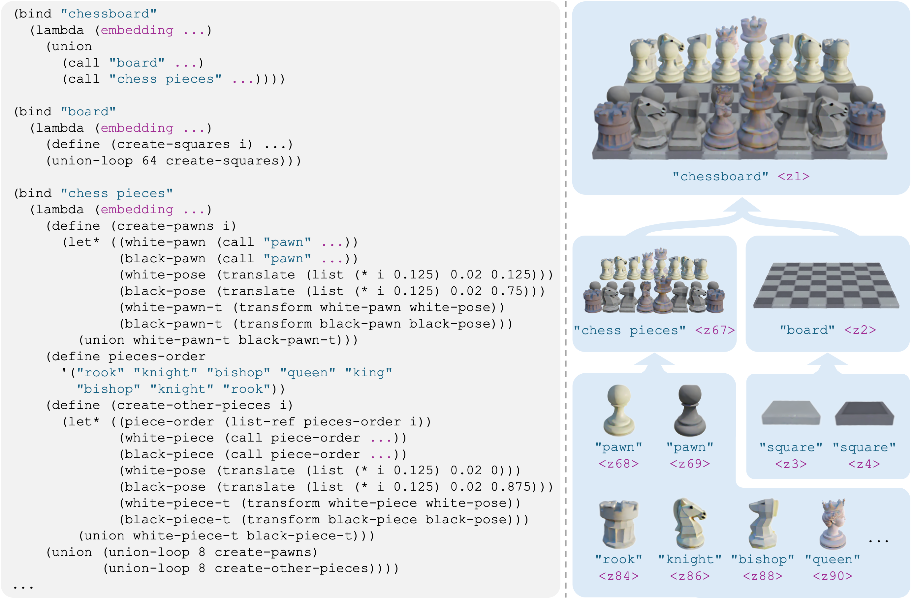

# The Scene Language: Representing Scenes with Programs, Words, and Embeddings

[arXiv](https://arxiv.org/abs/2410.16770) | [Project Page](https://ai.stanford.edu/~yzzhang/projects/scene-language/)

[Yunzhi Zhang](https://cs.stanford.edu/~yzzhang), [Zizhang Li](https://kyleleey.github.io/), Matt Zhou, [Shangzhe Wu](https://elliottwu.com/), [Jiajun Wu](https://jiajunwu.com/). arXiv preprint 2024.



### Installation

#### Environment

```bash
conda create --name sclg python=3.11
conda activate sclg
pip install mitsuba 
# if you encountered Segmentation fault on MacOS, run `pip install --force-reinstall mitsuba==3.5.1`
pip install --force-reinstall numpy==1.26.4  # to be compatible with transforms3d
pip install unidecode Pillow anthropic transforms3d astor ipdb scipy jaxtyping imageio

# required for minecraft renderer
pip install spacy
python -m spacy download en_core_web_md

git clone https://github.com/zzyunzhi/sclg.git
cd sclg
pip install -e .
```

#### Language Model API
Get your Anthropic API key following the [official documentation](https://docs.anthropic.com/en/api/getting-started#accessing-the-api)
and add it to `engine/key.py`:
```python
ANTHROPIC_API_KEY = 'YOUR_ANTHROPIC_API_KEY'
OPENAI_API_KEY = 'YOUR_OPENAI_API_KEY'  # optional, required for `LLM_PROVIDER='gpt'`
```
By default, we use Claude 3.5 Sonnet. You may switch to other language models by setting `LLM_PROVIDER` in `engine/constants.py`.


### Text-Conditioned 3D Generation

#### Renderer: Mitsuba

```bash
python scripts/run.py --tasks "a chessboard with a full set of chess pieces" 
```

Example results (raw outputs [here](resources/results/mitsuba)):

<table>
<tr>
<th width="20%">"a chessboard with a full set of chess pieces"</th>
<th width="20%">"A 9x9 Sudoku board partially filled with numbers"</th>
<th width="20%">"a scene inspired by Egon Schiele"</th>
<th width="20%">"a Roman Colosseum"</th>
<th width="20%">"a spider puppet"</th>
</tr>
<tr>
<td></td>
<td></td>
<td></td>
<td></td>
<td></td>
</tr>
</table>

#### Renderer: Minecraft

```bash
ENGINE_MODE=minecraft python scripts/run.py --tasks "a detailed cylindrical medieval tower"
```

To visualize Minecraft results, run the following command, open [http://127.0.0.1:5001](http://127.0.0.1:5001) in your browser, and drag generated `renderings/${root_function_name}/*.json` to the web page and visualize.
```bash
python viewers/minecraft/run.py
```

Example results (raw outputs [here](resources/results/minecraft)):

<table>
<tr>
<th width="20%">"a witch's house in Halloween"</th>
<th width="20%">"a detailed cylindrical medieval tower"</th>
<th width="20%">"a detailed model of Picachu"</th>
<th width="20%">"Stonehenge"</th>
<th width="20%">"a Greek temple"</th>
</tr>
<tr>
<td></td>
<td></td>
<td></td>
<td></td>
<td></td>
</tr>
</table>


### Image-Conditioned 3D Generation
```bash
python scripts/run.py --tasks ./resources/examples/* --cond image --temperature 0.8
```


### Codebase Details

<details>
<summary>Macro definitions</summary>


The following table lists helper functions defined in [this](scripts/outputs/stubgen/20241020-145124-exposed-calc/header.pyi) file  in accordance with expressions defined in the domain-specific language (DSL) (Tables 2 and 5 of the paper):

| Implementation | DSL |
|----------------------|----------------|
| `register`           | `bind`         |
| `library_call`       | `call`         |
| `primitive_call`     | `call`         |
| `loop`               | `union-loop`   |
| `concat_shapes`      | `union`        |
| `transform_shape`    | `transform`    |
| `rotation_matrix`    | `rotation`     |
| `translation_matrix` | `translate`    |
| `scale_matrix`       | `scale`        |
| `reflection_matrix`  | `reflect`      |
| `compute_shape_center` | `compute-shape-center` |
| `compute_shape_min`  | `compute-shape-min` |
| `compute_shape_max`  | `compute-shape-max` |
| `compute_shape_sizes` | `compute-shape-sizes` |


</details>


### Code release plan

The current codebase allows you to generate 3D scenes with text or image prompts. Other tasks and renderers reported in the paper will be supported in future updates. 

We welcome contributions---please submit a PR if you have feature requests, enhancements, or would like to share results. :)

### Citation

If you find this work useful, please cite our paper:

```bibtex
@article{zhang2024scenelanguage,
  title={The Scene Language: Representing Scenes with Programs, Words, and Embeddings},
  author={Yunzhi Zhang and Zizhang Li and Matt Zhou and Shangzhe Wu and Jiajun Wu},
  year={2024},
  journal={arXiv preprint arXiv:2410.16770},
}
```
