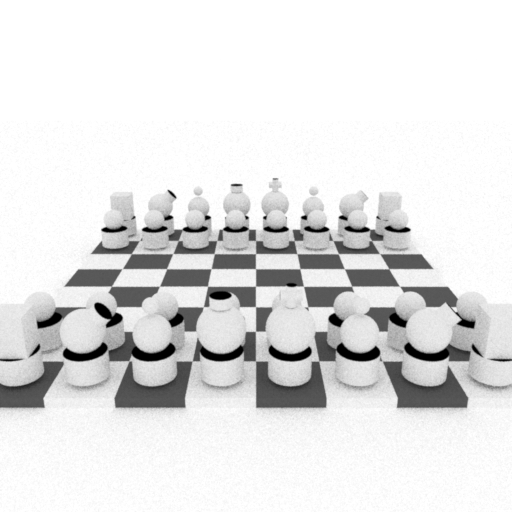
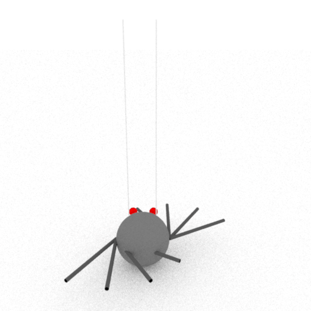

# The Scene Language: Representing Scenes with Programs, Words, and Embeddings

[arXiv](https://arxiv.org/abs/2410.16770) | [Project Page](https://ai.stanford.edu/~yzzhang/projects/scene-language/)

[Yunzhi Zhang](https://cs.stanford.edu/~yzzhang), [Zizhang Li](https://kyleleey.github.io/), Matt Zhou, [Shangzhe Wu](https://elliottwu.com/), [Jiajun Wu](https://jiajunwu.com/). arXiv preprint 2024.


### Installation

#### Environment

```bash
conda create --name sclg python=3.11
conda activate sclg
pip install mitsuba 
# if you encountered Segmentation fault on MacOS, run `pip install --force-reinstall mitsuba==3.5.1`
pip install --force-reinstall numpy==1.26.4  # to be compatible with transforms3d
pip install unidecode Pillow anthropic transforms3d astor ipdb scipy jaxtyping imageio

git clone https://github.com/zzyunzhi/sclg.git
cd sclg
pip install -e .
```

#### Language Model API
Get your Anthropic API key following the [official documentation](https://docs.anthropic.com/en/api/getting-started#accessing-the-api)
and add it to `engine/key.py`:
```python
ANTHROPIC_API_KEY = 'YOUR_ANTHROPIC_API_KEY'
OPENAI_API_KEY = 'YOUR_OPENAI_API_KEY'  # optional, required for `LLM_PROVIDER='gpt'`
```
By default, we use Claude 3.5 Sonnet. You may switch to other language models by setting `LLM_PROVIDER` in `engine/constants.py`.


### Text-Conditioned 3D Generation

#### Renderer: Mitsuba

```bash
python scripts/run.py --tasks "a chessboard with a full set of chess pieces" 
```

Example results:

| "a chessboard with a full set of chess pieces" | "a scene inspired by Egon Schiele" | "a Roman Colosseum" | "a spider puppet"
|:---:|:---:|:---:|:---:|
|  |  |  |  |

#### Renderer: Minecraft

```bash
ENGINE_MODE=minecraft python scripts/run.py --tasks "a detailed cylindrical medieval tower"
```

To visualize Minecraft results, run the following command, open [http://127.0.0.1:5001](http://127.0.0.1:5001) in your browser, and drag generated `renderings/${root_function_name}/*.json` to the web page and visualize.
```bash
python viewers/minecraft/run.py
```

#### Other Renderers
Code will be released upon paper acceptance.


### Image-Conditioned 3D Generation
```bash
python scripts/run.py --tasks ./resources/examples/* --cond image --temperature 0.8
```
